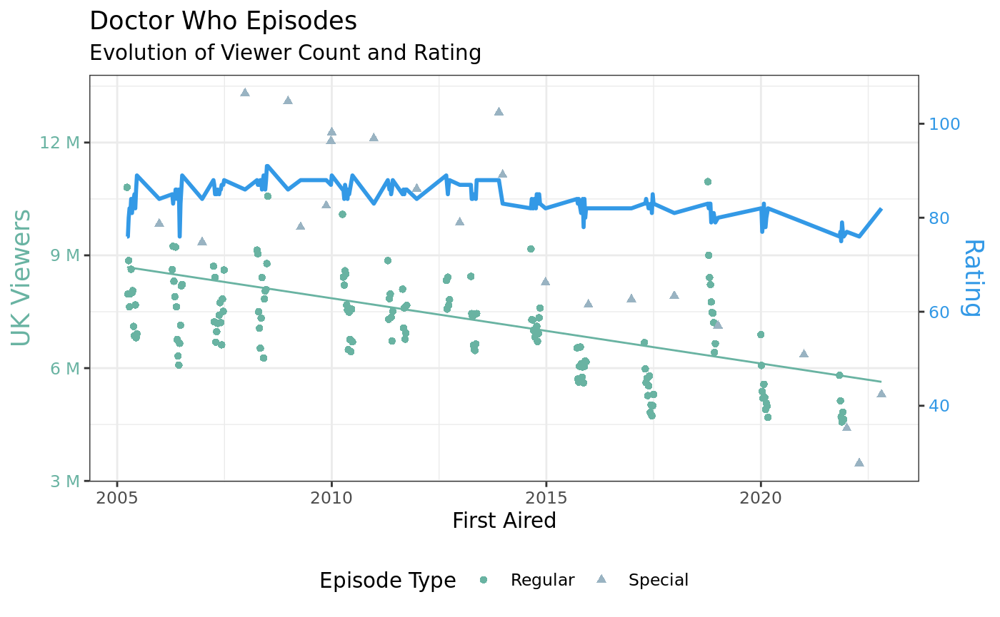

# Doctor Who: Tidy Tuesday 11/28/2023

## Dataset

The dataset used is derived from the 11/28/2023 edition of Tidy Tuesday (<https://github.com/rfordatascience/tidytuesday>), a weekly social data project that aims to make learning to work with data easier by providing real-world datasets. Comprehensive data for the modern era of Doctor Who episodes is included in the R `datardis` package (<https://cran.r-project.org/web/packages/datardis/index.html>).

## Visualization

The visualization expresses the general sentiment towards Doctor Who episodes since the modern era (from 2005) through two main factors: viewer count in the United Kingdom, where most of the viewer base is, and rating, which is expressed as a percentage, 100% being a perfect reception. Both variables are expressed on the same graph even though they are on very different scales, which is remedied by there being a color-coded dual y-axis - UK viewership is expressed in green on the left side with a scatter plot, whereas rating is displayed in a blue line graph on the right. The visualization shows that the rating of each episode has remained extremely constant across the 20 years of the show, bouncing around the 80-90 range, which is generally considered excellent for a TV series. Bizarrely, the viewership does not reflect this apparent quality consistency: as shown by the line of best fit in green, the number of UK viewers has consistently gone down since the beginning of the modern era, going from around 9 million in 2005 to around 6 million in 2023. Even specials (represented by lighter triangles), which generally have a much higher view count than regular episodes, have also steadily reduced in viewer count - while a 2008 special obtained a record 13 million viewers, one in 2022 only amassed 3 million. This discrepancy could be explained through the aging of the original fan base - while Doctor Who was immensely popular in 2005, it seems that the new generations are more reluctant to engage with the show.

